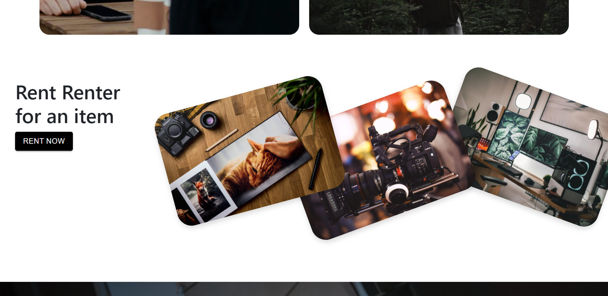

 | 
# RENT FORM ME

Renter From Me: like AirBnB, but for high-end electronics. Are you tired of paying ridiculous fees for camera and other equipment rentals? Bypass the middleman and rent from a real person!
## The MVP of this project is 

>1. Two user types: owners and renter
>2. user can login and create a profile
>3. user can then setup items they have for rent such as cameras, TV's, party equipment such as speakers/fog machines, etc.
>4. user will be able to create, read, update and delete rental data. A second user can login and see items that users have for rent and ask to rent an item

## Stretch

>- Add a payment option into the application allowing a user to pay over Paypal / Stripe etc. to rent their items
>- Be able to schedule a time and place for pick-up
>- Add a review system into the app so that the social aspect is there to ensure that users are legitimate.

## The Tools that I Use

| Programming | Styling | In Future|
| --------------- | --------------- | --------------- |
|   |  |  |
|  |   |   |
|   |   |   |

## `What did I learn?`

#### Learned in this project

> - how to setup redux with middleware
> - how to connect the frontend to api
> - how to make authentication
## Can I see a final version of the  projects 

 

**A** Sure!

> **Here you go:  [here](https://renter-me.netlify.app/).**

## Deployment 

Netlify unites an entire ecosystem of modern tools and services into a single, simple workflow for building high performance sites and apps.
and is continuous Deployment of our websit [here](https://renter-me.netlify.app/).**

## Problems 

>- fetch api : fetch a api's and loading are some times does not work good 
>- dispatch : in redux's their is some problem a useEffect to dispatch a actions 
>- login and registartion : when you login is not open the home  page and register is same error
>- styling : component isn't good styling and Responsive of the page as not good need a little work on
>- no animation yet 
>- l will want to add a stretching problem 

## Summry

this project is part of my frontend project at  **[GabiSchool Bootcamp](https://gabischool.com/)**   in 2022 thank you to give this **amazing skill**